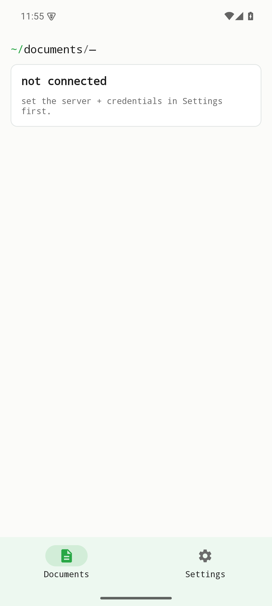
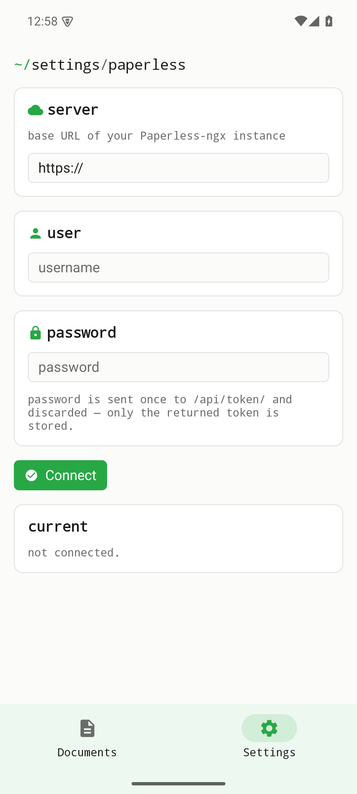

Établi Doc is a lean, native client for a self-hosted Paperless-ngx instance. It talks only to the server you point it at — there is no central service and no third party in between. The figures below are real screenshots of the **v0.1.0** Android build; nothing here is mocked up.

## Not connected — the starting state

When you first open Établi Doc, no Paperless-ngx server is configured yet. The home tab uses the suite's terminal-style breadcrumb and clearly states that no server is set, pointing you to enter the server and credentials in Settings first. Nothing is fetched until you connect.

{width=320}

## Settings — server & credentials

Settings is where you enter your Paperless-ngx instance URL and API credentials. Credentials live only in the platform secure store (Android EncryptedSharedPreferences) and are sent only to the server you configure. Once connected, the app talks directly to your own instance.

{width=320}

## Backend-dependent screens

The data screens — browsing, searching, viewing and managing your Paperless-ngx content — require a **reachable Paperless-ngx instance and valid credentials**, which this capture run did not have. Those screens are intentionally **not faked** here. They become available once you connect a server in Settings, and a future capture against a test Paperless-ngx instance will extend this walkthrough with the live data views.

## Where to get it

Établi Doc is under active development. The current release is an **Android-only development build (signed APK)**:

- Android (signed APK): [v0.1.0 release](https://github.com/etabli-dev/etabli-doc/releases/tag/v0.1.0)
- App Store (iOS) · Google Play (Android) · F-Droid: planned — not yet available
