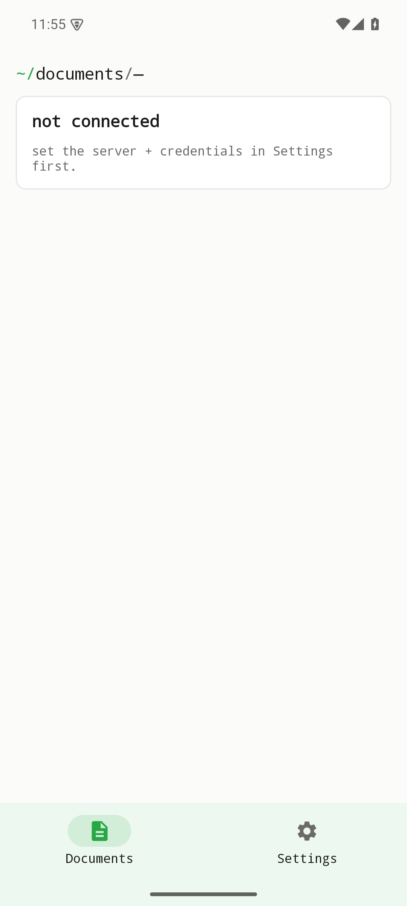
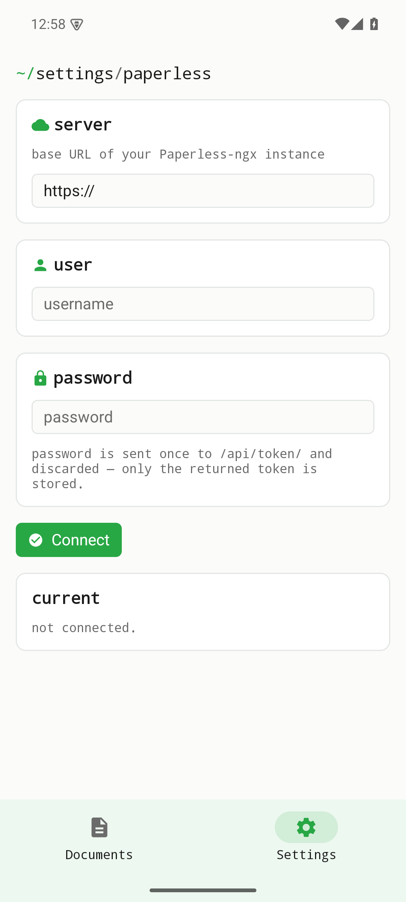

Search Paperless-ngx document metadata. iOS additionally previews originals. Upload, editing and deletion are unavailable; results show the first page.

This page describes the October 2026 source revision. These changes are unpublished and are not part of older development releases. Local checks are distinct from device, live-service and store acceptance.

[Current status / Aktueller Stand / État actuel](../current-status.qmd)

Historical screenshots from v0.1.0; these are not verification of the current revision.

{width=320}

{width=320}
