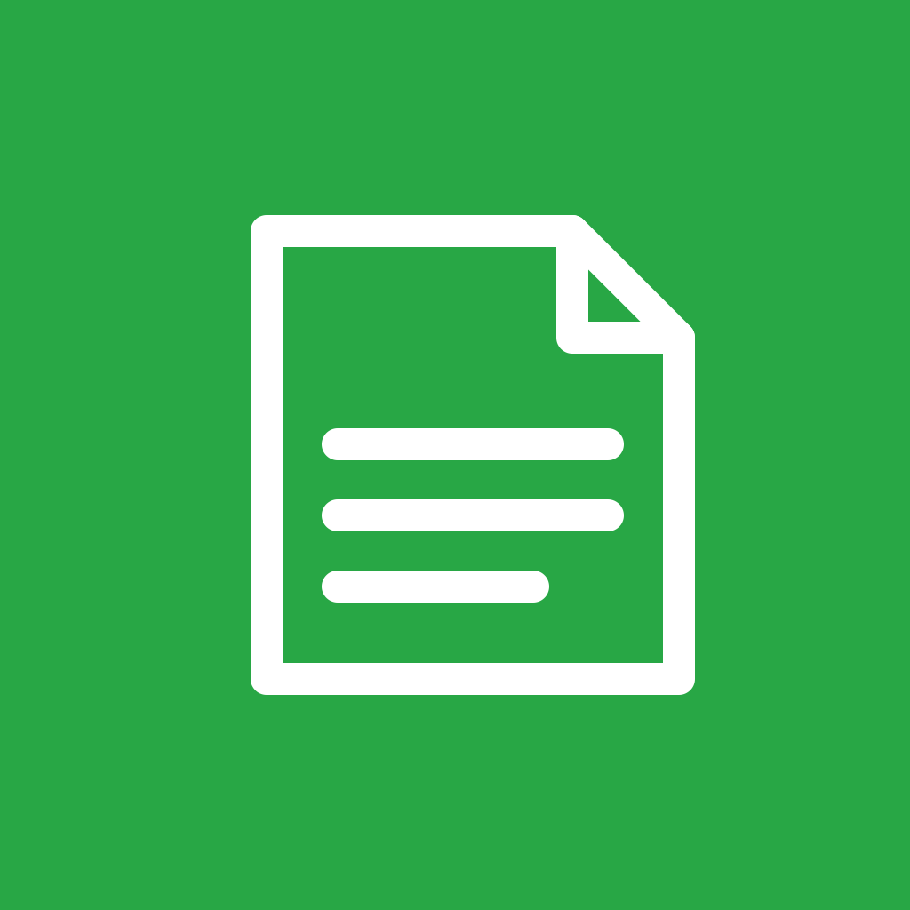
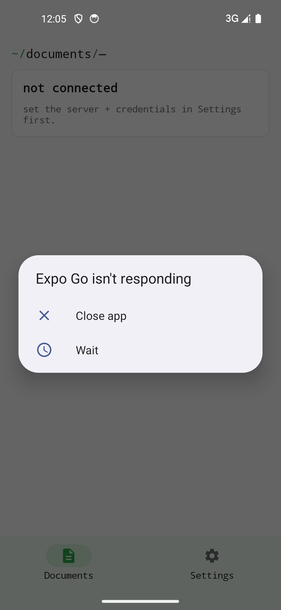

Client auto-hébergé

> Vos documents Paperless-ngx, en mobilité.

Établi Doc est un client natif iOS et Android pour une instance Paperless-ngx auto-hébergée. Parcourir, chercher, travailler avec les étiquettes, correspondants et types de document — directement contre votre propre serveur. Aucun service central, aucun intermédiaire, aucune télémétrie.

{width=320}

## À qui ça s'adresse

À toute personne hébergeant Paperless-ngx qui souhaite accéder à ses documents non seulement au bureau mais aussi en déplacement — par exemple pour montrer un PDF archivé en réunion ou retrouver une facture.

## Plateformes

| Plateforme | Statut |
|------------|--------|
| iOS        | ✓      |
| Android    | ✓      |

## Vie privée

Aucun outil d'analyse, aucun SDK tiers. L'authentification se fait sur votre serveur Paperless-ngx auto-hébergé. Les identifiants (URL + jeton d'API) résident uniquement dans le coffre-fort de la plateforme (iOS Keychain · Android EncryptedSharedPreferences) et ne sont envoyés qu'à l'instance configurée.

## Installation

Établi Doc est **en cours de développement actif**. Il n'existe pas encore de version App Store, Google Play ou F-Droid.

| Canal | Statut |
|-------|--------|
| Android (APK) | **Version de développement** via [GitHub Releases](https://github.com/etabli-dev/etabli-doc/releases) |
| App Store (iOS) | prévu — pas encore disponible |
| Google Play | prévu — pas encore disponible |
| F-Droid | prévu — pas encore disponible |

Détails : voir [Premiers pas](getting-started.qmd).

## Soutenir

Si l'appli vous est utile : [Liberapay](https://liberapay.com/rabanheller/) · dans l'appli même vous trouverez également un lien Buy-Me-a-Coffee.
